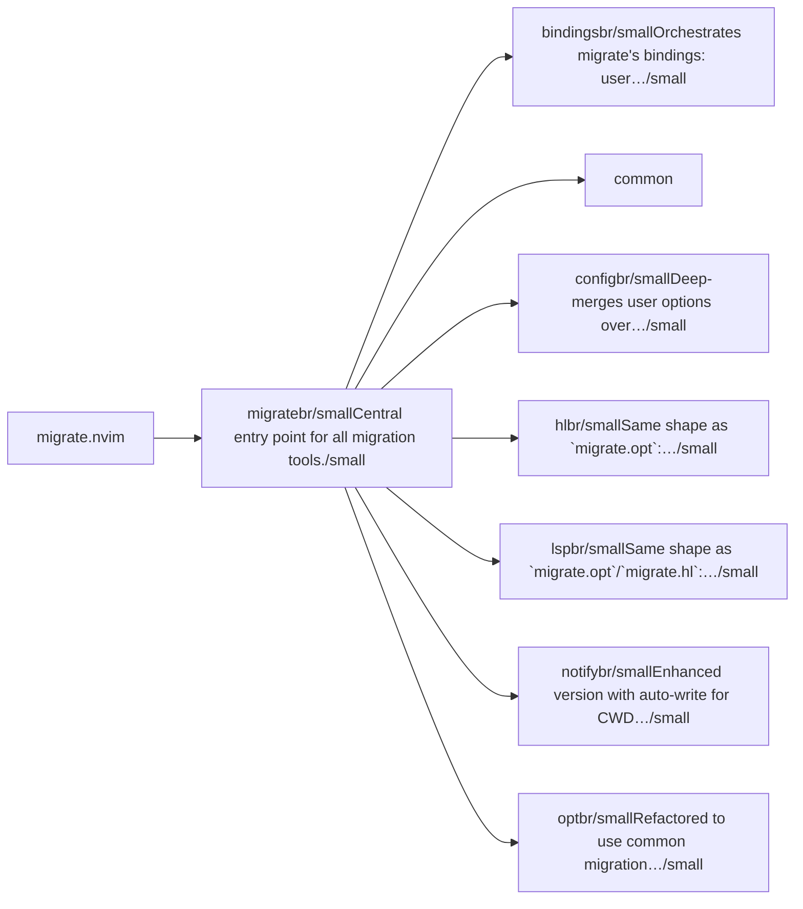
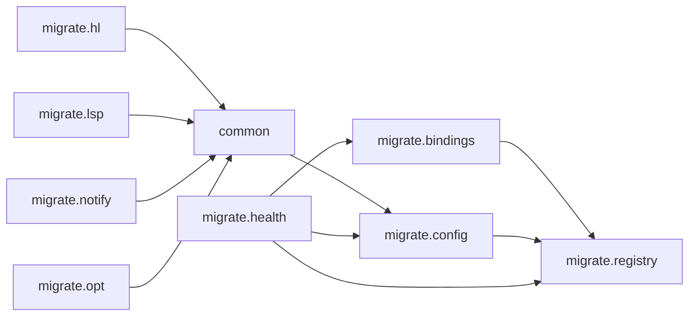

# migrate.nvim — module map

> **Generated** by `documentation`. Do not edit by hand — run `:DocMap`
> (or `nvim --headless -l scripts/gen_map.lua`) to regenerate.

**9 modules** · 2 namespaces · 22 helper files

The [interactive map](index.html) has filtering, full descriptions and
source links; this page is the version the code host renders directly.

## Namespaces

## Dependencies

Which parts of the tree require which, rolled up to the second level.
The [interactive map](index.html)'s **Deps** view has this per module,
in both directions, with load-time and lazy requires told apart.

## Modules

| Module | Description | Fns | Docs |
|---|---|---|---|
| `migrate` | Central entry point for all migration tools. | 3 | [src](../../lua/migrate/init.lua) |
| &nbsp;&nbsp;`migrate.bindings` | Orchestrates migrate's bindings: user commands and optional keymaps. | 1 | [src](../../lua/migrate/bindings/init.lua) |
| &nbsp;&nbsp;`common` |  |  |  |
| &nbsp;&nbsp;`migrate.config` | Deep-merges user options over `migrate.config.DEFAULTS` and exposes a single `get()` accessor so other modules never read a raw options table directly. | 2 | [src](../../lua/migrate/config/init.lua) |
| &nbsp;&nbsp;`migrate.hl` | Same shape as `migrate.opt`: line/range/buffer(`%`)/cwd modes through the shared `migrate.common.command` factory. | 6 | [src](../../lua/migrate/hl/init.lua) |
| &nbsp;&nbsp;`migrate.lsp` | Same shape as `migrate.opt`/`migrate.hl`: line/range/buffer(`%`)/cwd modes through the shared `migrate.common.command` factory. | 6 | [src](../../lua/migrate/lsp/init.lua) |
| &nbsp;&nbsp;`migrate.notify` | Enhanced version with auto-write for CWD mode | 9 | [src](../../lua/migrate/notify/init.lua) |
| &nbsp;&nbsp;&nbsp;&nbsp;`migrate.notify.parser` | Main parser orchestrator | 1 | [src](../../lua/migrate/notify/parser/init.lua) |
| &nbsp;&nbsp;&nbsp;&nbsp;`migrate.notify.refactor` | Main refactor orchestrator |  | [src](../../lua/migrate/notify/refactor/init.lua) |
| &nbsp;&nbsp;`migrate.opt` | Refactored to use common migration infrastructure. | 6 | [src](../../lua/migrate/opt/init.lua) |

## Drift

0 errors · 5 warnings · 16 info

| Severity | Check | Message |
|---|---|---|
| warn | `doc-references-missing` | docs/FEATURES.md:117 references 'migrate.init', but migrate has no 'init' |
| warn | `doc-references-missing` | docs/architecture.md:29 references 'migrate.init', but migrate has no 'init' |
| warn | `doc-references-missing` | docs/ROADMAP/Checklist.md:18 references 'migrate.config.options', but migrate.config has no 'options' |
| warn | `doc-references-missing` | docs/ROADMAP/Arch&Coding.md:33 references 'migrate.config.options', but migrate.config has no 'options' |
| warn | `missing-summary` | lua/migrate/common/@types.lua has no description line |

16 informational findings

| Check | Message |
|---|---|
| `missing-readme` | lua/migrate has no README.md |
| `missing-readme` | lua/migrate/bindings has no README.md |
| `missing-readme` | lua/migrate/config has no README.md |
| `missing-readme` | lua/migrate/hl has no README.md |
| `missing-readme` | lua/migrate/lsp has no README.md |
| `missing-readme` | lua/migrate/notify has no README.md |
| `missing-readme` | lua/migrate/notify/parser has no README.md |
| `missing-readme` | lua/migrate/notify/refactor has no README.md |
| `missing-readme` | lua/migrate/opt has no README.md |
| `unreferenced-module` | migrate is required by no other file in the tree |
| `unreferenced-module` | migrate.common.@types is required by no other file in the tree |
| `unreferenced-module` | migrate.health is required by no other file in the tree |
| `unreferenced-module` | migrate.hl is required by no other file in the tree |
| `unreferenced-module` | migrate.lsp is required by no other file in the tree |
| `unreferenced-module` | migrate.notify is required by no other file in the tree |
| `unreferenced-module` | migrate.opt is required by no other file in the tree |

